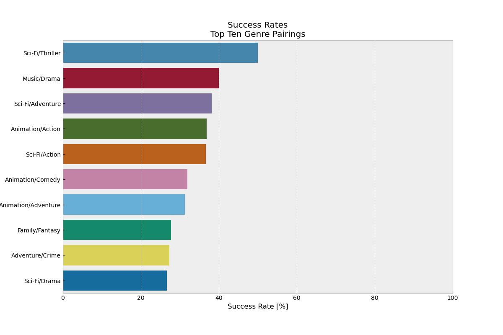

# An analysis of How to be a Successful Film Studio
## Flatiron Academy: Phase-1-Project
##### Author: Carl Schneck
<!--
Welcome to my Data-Science Phase 1 project for Flatiron Academy!

It is a market analysis on films to help an imaginary client at Microsoft, whom is interested in adventuring into the film industry after seeing other big companies success. This projects focus is to analyze a movie review database and help microsoft make an educated decision on the direction they should take to be succesffull in the industry of film making. I'll be utilizing basic statistical analysis and visualizations to give three recomendations. These will be a part of a five to ten minute non-technical presentation given to a Microsoft stakeholder role being played by one of Flatiron's instructors. A jupyter notebook will also be utilized to explain my process on the back end to achieve these results.
 -->

#### Links
[Jupyter Notebook](index.ipynb) 
[Presentation](Presentation.pdf)

#### Navigating Repository

Jupyter Notebook: top-level 
Presentation: top-level 
ZippedData: top-level 
Readme: top-level 
Images: images/ 
Data Figures: images/figure/ 
Movie Cover Images: images/FilmCovers/ 

## Introduction:

Microsoft has a newly found interest in creating their own original video content and are moving forward by starting their own movie studio. The question to be explored is what direction Microsoft should pursue to make sure they are on a path to success. There are a couple possible ways to determine if a film has been successful. The first is by looking at ratings and reviews. The second is by determining if the film was profitable. While it would be ideal for both of these to happen coincidingly it may not always be possible. For instance a film may have stellar ratings, but placed in a niche market and have a low ceiling for box office sales. For instances like this it may be better to concentrate on ensuring a positive return on the financial investment. By trying to ensure a profit the film studio can continue to pursue future projects as well as realize a return on their investment. Therefore this analysis will concentrate on the monetary factors instead of ratings to determine the correct path for Microsoft.

After a film has been determined successful, there are a few metrics that can be used help determine why. These metrics include genre, persons of interest and release date. People tend to have favorites, therefore it should be possible to find which genre, actor or director pulls in the most box office sales. Releasing a film at the right time also plays a major part. Films are only in theaters for a limited amount of time, so placing them at the right part of the year can be greatly beneficial. This analysis will concentrate on finding suggestions in regards to the most successful genres.

## Goal:

The overall goal for this analysis is to lead Microsoft on a successful journey into making their own original video content. This will be achieved by supplying Microsoft with three actions that will give them the highest chance of success.

## Business Understanding and Method

Now what monetary factors need to be considered to determine a profitable film. Each film has different revenue streams as well as expenses. The data resources available permit the use of box office revenues, as well as production budget for expenses. Some research from the links below give insight on what percentage the film studio actually realizes after taxes and the cinema's get their share. This source of information also supplied a guideline to calculate the marketing costs in relation to production budget for films with a production budget greater than $30 million. Since this information was only available for films in that production range, those will be the only ones included in this analysis. Though a brief analysis showing why it is dificult to analyze those films without that information will be made. Analyzing these details will give a reasonable answer to what determines a film to be profitable.

[How movies make money: $100m+ Hollywood blockbusters](https://stephenfollows.com/how-movies-make-money-hollywood-blockbusters/)
[How films make money pt2: $30m-$100m movies](https://stephenfollows.com/films-make-money-pt2-30m-100m-movies/)

The information regarding marketing costs and adjusted gross revenues for cinema shares and taxes acquired from these articles is listed below.

- Average Domestic Gross Revenue Realized =~ 53%
- Average International Gross Revenue Realized =~ 41%
- Marketing Costs =~ 81% of Production Budget when Production Budget >= $100 Million 
- Marketing Costs =~ 100% to 120% of Production Budget when Production Budget Between $30-$100 Million

Therefore a film is determined to be profitable if:

(Adjusted Domestic Gross Revenue) + (Adjusted Internation Gross Revenue) > (Production Budget) + (Marketing Costs)

Where Adjusted Gross Revenues are the box office revenue figures provided adjusted to take out the percentage taken from Taxes and Cinema Shares.
    
Now that the definition of a profitable film has been made, movie genres that will ensure the best chance to succeed will be researched. First genres will be looked at seperately followed by an analysis of genre pairings. The success rate, average Percentage on Investment (POI), and correlation between Production Budget and POI will be used to determine the best genres and pairings. Groups with high success rates and average Percentage on Investment will be placed on the top of the list. While groups with either high or no correlation between production budget and POI will be considered. High correlation will be considered because it gives an easily manageable metric that is directly related to the return on investment. Groups with no correlation will also be considered if the grouping meets the other two conditions. Reason being that no correlation will show that the risk can be limited by not requiring a high expense line.

## Conclusion

Using the metrics and conditions mentioned above, we arrived at the following three suggestions:

###  Sci-Fi and Thriller

The genre pairing of Sci-Fi and Thriller genres has the highest average Percentage of Investment (POI) as shown in the non-tiered POI box plot Figure below above. It is the only genre pairing that has an average POI that is profitable. Though the box plot shows that the pairings median POI value was around -20%,  the success rate shown in the top right figure is 50%. Meaning that half of the films within this genre pairing were profitable with a positive POI. While looking at the production budget tiered figures, there appears to be more success in the higher production budget range (Blockbusters). The success rate of Blockbusters is 67% and has a strong correlation between production budget and POI. Though the suggestion to invest in Blockbuster Sci-Fi and Thriller films must be reserved because the sample size might be too small to rely on these split metrics, with only three out of the ten films covering these genres being Blockbusters. The success rate for this genre pairing for films under a Blockbuster production budget is still around 43%, though there appears to be a negative correlation between production budget and POI in that range. Though these correlation coefficients may be tricky to deal with, the overall success rate of the Sci-Fi and Thriller pairing is a stellar 50% while also having the highest average POI of all combinations. So it is believed that this suggestion will have a great chance of success.

### Sci-Fi and Adventure - Blockbuster Film 

The Sci-Fi and Adventure pairing had 50 of its 55 films in the Blockbuster production budget range (Greater than $100 million). Of pairings with more than 10 blockbusters, this pairing had the highest success rate at 40% and average Percentage on Investment (POI) at -4%. Observing the POI production budget tiered boxplot below, this blockbuster pairing had a median close to zero POI with a 75th percentile comfortably above being profitable at around a 30% POI. There is also no correlation between production budget POI when this pairing is made as a blockbuster. Therefore this suggestion is to proceed in the direction of a Blockbuster Sci-Fi and Adventure film.

### Animation and Action - Blockbuster Film

The Animation and Action pairing is being suggested mostly because of its high correlation of around .72 between Production Budget and Percentage on Investment (POI). Though the Blockbuster Sci-Fi and Thriller pairing had an even higher correlation, it only had a sample size of three films to the sample size of 13 films for the Animation and Action pairing. Concentrating on this metric can give Microsoft a different approach at attempting to create a successful film by trying to invest more to receive a higher POI. This method does sound risky but this pairing is also backed by having a 38.5% success rate as blockbuster films, making it the second most commonly successful Blockbuster pairing behind Sci-Fi and Adventure. The POI production budget tiered box plot shown below also points out that this genre pairing's median POI value is very close to zero. Meaning that nearly 50% of Animation and Action films were either successful or very close to breaking even.

### Future Improvements

The metrics used during this analysis were by far not exhaustive. There were a metrics available in the datasets presented at the beginning of this project that weren't used. This includes ratings a reviews, which would give insight as to what critics as well as normal patrons believe about the film. Reviews in particular could have given a direct insight into what patrons enjoyed or disliked about films. Another piece of data not used was person's of interest. Which actors and directors resulted in better sales could have lead our suggestions to be even more precise. The release date could have also been analyzed to give a better idea of optimal releasing periods.

There was also data missing that could have been valuable. This includes exact marketing costs for films istead of a general estimation from a limited sample data set. Marketing data was also completely absent for films with a production budget under $30 million leaving a large chunk of films left unanalyzed. There are also other streams of revenue and expenses that could have been included. Movies often times result in great merchandising sales which would probably be pretty genre specific. Film studios also create contracts with airlines and tv box networks to have permission to their films after they are pulled from theaters. Additional expenses include studio overhead, cast and crew residuals, physical prints sent to theaters, and financing costs if loans needed to be taken out. If all these metrics were included in the future more and possible better suggestions could be made. 

## Resources

- Galloway, Stephen. “What Is the Most Profitable Movie Ever?” The Hollywood Reporter, The Hollywood Reporter, 18 Jan. 2020, https://www.hollywoodreporter.com/movies/movie-news/what-is-profitable-movie-ever-1269879/.

- Stephen Follows, Stephen. “How Films Make Money PT2: \$30m-\$100M Movies.” Stephen Follows, 6 July 2021, https://stephenfollows.com/films-make-money-pt2-30m-100m-movies/.

- Stephen Follows, Stephen. “How Movies Make Money: \$100m+ Hollywood Blockbusters.” Stephen Follows, 6 July 2021, https://stephenfollows.com/how-movies-make-money-hollywood-blockbusters/.

